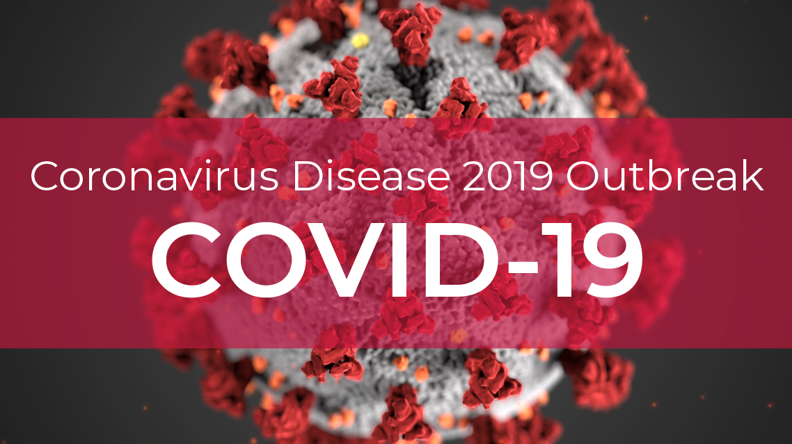
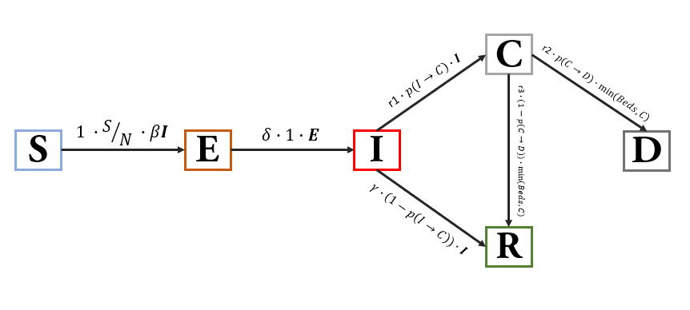

# COVID19_prediction
   
EE7390: Pattern Recognition and Machine Learning (Project)   
Grade: **A+**   
Date: March-2020     
BTech-EE, IIT Hyderabad   

# SEIRD  Model:
* **S**usceptible (can be infected, 'Healthy')
* **E**xposed (infectious but can't spread disease, 'Healthy')
* **I**nfected (infectious and can spread disease)
* **R**ecovered (were infected, but now immnune to the disease)
* **D**eath (deceased)

    

# Future Work: SEICRD  Model:
* **S**usceptible (can be infected, 'Healthy')
* **E**xposed (infectious but can't spread disease, 'Healthy')
* **I**nfected (infectious and can spread disease)
* **C**ompartment (admitted to the hospital)
* **R**ecovered (were infected, but now immnune to the disease)
* **D**eath (deceased)

   
